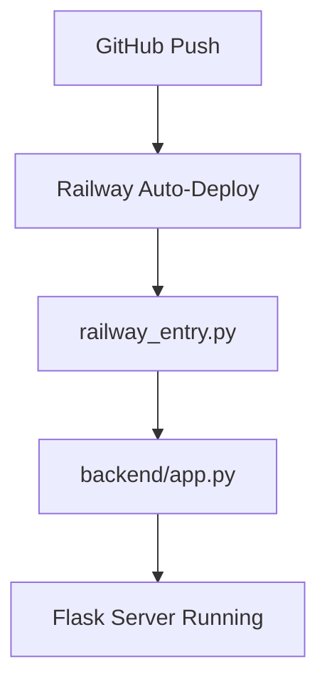

# 📋 DOCUMENTAÇÃO TÉCNICA - LOTECA X-RAY

## 🎯 **VISÃO GERAL DO PROJETO**

**Nome:** Loteca X-Ray - Análise Inteligente da Loteca  
**Domínio:** `lotecainteligente.com.br` (em configuração)  
**Deploy:** Railway - `https://loteca-inteligente-production.up.railway.app/loteca`  
**Repositório:** `https://github.com/dacostaEF/loteca-inteligente`

---

## 🏗️ **ARQUITETURA DO SISTEMA**

### **Stack Tecnológico:**
- **Backend:** Python 3.x + Flask
- **Frontend:** HTML5 + CSS3 + JavaScript (Vanilla)
- **APIs:** Cartola FC (oficial) + Football API (futuro)
- **Deploy:** Railway + GitHub Actions
- **Servidor:** Gunicorn + WSGI

### **Estrutura de Arquivos:**
```
📦 loteca-inteligente/
├── 📄 railway_entry.py         # Entry point para Railway
├── 📄 wsgi.py                  # WSGI para Gunicorn
├── 📄 Procfile                 # Configuração Railway
├── 📄 railway.json             # Deploy settings
├── 📄 requirements.txt         # Dependências Python
├── 📄 README.md               # Documentação do projeto
├── 📄 .gitignore              # Arquivos ignorados
│
├── 📁 backend/                # 🎯 CORE DA APLICAÇÃO
│   ├── 📄 app.py              # Flask app principal
│   ├── 📄 routes_brasileirao.py    # APIs dados brasileiros
│   ├── 📄 routes_internacional.py  # APIs dados internacionais
│   │
│   ├── 📁 services/           # Providers de dados
│   │   ├── 📄 cartola_provider.py      # API Cartola FC
│   │   ├── 📄 football_api_provider.py # Mock/API-Football
│   │   └── 📄 loteca_provider.py       # Combina dados reais
│   │
│   ├── 📁 templates/          # Frontend
│   │   └── 📄 loteca.html     # SPA completa
│   │
│   ├── 📁 static/             # Assets
│   │   └── 🖼️ Logo_loteraisinteligente.png
│   │
│   └── 📁 __pycache__/        # Cache Python
│
└── 📁 antigos/                # Arquivos legados organizados
    ├── 📄 Loteca_X-Ray*.html
    └── 📁 templates/
```

---

## ⚡ **FLUXO DE EXECUÇÃO**

### **1. Deploy Flow:**


### **2. Request Flow:**
```
URL Request → Flask Router → Template Render → JavaScript → API Calls → Real Data
```

### **3. Detailed Flow:**
1. **Usuário acessa:** `lotecainteligente.com.br` (futuro)
2. **Railway executa:** `gunicorn wsgi:application`
3. **WSGI chama:** `railway_entry.py`
4. **Entry point configura:** Ambiente + `backend/app.py`
5. **Flask serve:** `templates/loteca.html`
6. **JavaScript carrega:** Dados via APIs `/api/br/*`
7. **Backend consulta:** Cartola FC + Mock data
8. **Frontend atualiza:** Interface com dados reais

---

## 🔌 **APIS IMPLEMENTADAS**

### **Brasileirão (Dados Reais):**
```
GET /api/br/health                    # Status da API
GET /api/br/clubes                    # Lista clubes Série A
GET /api/br/clube/{id}/stats          # Estatísticas do clube
GET /api/br/confronto/{time1}/{time2} # Análise confronto
GET /api/br/loteca/current            # 14 jogos atuais
GET /api/br/mappings                  # Mapeamento nomes→IDs
```

### **Internacional (Mock Data):**
```
GET /api/int/health                   # Status da API
GET /api/int/leagues                  # Ligas disponíveis
GET /api/int/fixtures/upcoming        # Próximos jogos
GET /api/int/fixture/{id}/analysis    # Análise detalhada
```

---

## 📊 **FONTES DE DADOS**

### **1. Cartola FC (100% Real):**
- **URL:** `https://api.cartola.globo.com/`
- **Dados:** Clubes, atletas, estatísticas, preços
- **Cache:** 10 minutos
- **Rate Limit:** Respeitado
- **Exemplos:**
  - `/clubes` - Lista de clubes
  - `/atletas/mercado` - Atletas no mercado
  - `/mercado/status` - Status do mercado

### **2. Football API (Futuro):**
- **Provider:** API-Football ou similar
- **Dados:** Ligas internacionais, odds, fixtures
- **Status:** Mock data implementado

### **3. Dados Combinados:**
- **Brasileiros:** Cartola FC (real)
- **Internacionais:** Mock/estimativas
- **Output:** 14 jogos da Loteca unificados

---

## 🎨 **FRONTEND TÉCNICO**

### **Tecnologia:**
- **SPA:** Single Page Application
- **Framework:** Vanilla JavaScript (sem dependências)
- **CSS:** Custom + CSS Grid/Flexbox
- **Responsivo:** Mobile-first design

### **Funcionalidades:**
- ✅ **Sistema de Abas:** Análise Rápida + Dados Avançados
- ✅ **Dados Reais:** Integração com APIs próprias
- ✅ **Cache Frontend:** Otimização de requests
- ✅ **Loading States:** UX indicators
- ✅ **Error Handling:** Fallback para mock data
- ✅ **Mobile Responsive:** Otimizado para smartphone

### **JavaScript Classes:**
```javascript
// Principais providers
class CartolaProvider {
    // Integração com API Cartola FC
}

class InternationalProvider {
    // Mock data + futuras APIs
}

// Funções principais
loadRealLotecaData()      // Carrega dados reais
updateUIWithRealData()    // Atualiza interface
showDetailedAnalysis()    // Análise avançada
```

---

## 🔧 **CONFIGURAÇÃO DE DEPLOY**

### **Railway Settings:**
```json
{
  "deploy": {
    "startCommand": "gunicorn wsgi:application --bind 0.0.0.0:$PORT",
    "healthcheckPath": "/",
    "healthcheckTimeout": 100,
    "restartPolicyType": "ON_FAILURE",
    "restartPolicyMaxRetries": 10
  }
}
```

### **Dependências Python:**
```txt
Flask==2.3.3
Flask-CORS==4.0.0
requests==2.31.0
python-dotenv==1.0.0
python-dateutil==2.8.2
gunicorn==21.2.0
```

### **Variáveis de Ambiente:**
```bash
PORT=5000                    # Railway auto-define
FLASK_DEBUG=False           # Produção
SECRET_KEY=loteca-xray-key  # Flask secret
```

---

## 🚀 **DEPLOYMENT**

### **Processo Automatizado:**
1. **Push para GitHub** → Railway detecta
2. **Railway executa** → Build + Deploy
3. **Gunicorn inicia** → App disponível
4. **Health check** → Status OK

### **URLs Importantes:**
- **Produção:** `https://loteca-inteligente-production.up.railway.app/loteca`
- **API Info:** `https://loteca-inteligente-production.up.railway.app/api`
- **Health Check:** `https://loteca-inteligente-production.up.railway.app/api/br/health`

---

## 🔍 **PONTOS PARA AVALIAÇÃO**

### **✅ Pontos Fortes:**
1. **Same-Origin Architecture:** Sem problemas de CORS
2. **Dados Reais:** Integração com Cartola FC oficial
3. **Estrutura Organizada:** Separação clara de responsabilidades
4. **Deploy Automatizado:** CI/CD via Railway
5. **Error Handling:** Fallbacks implementados
6. **Mobile-First:** Otimizado para smartphone
7. **Caching:** Otimização de performance

### **🔶 Pontos de Atenção:**
1. **API Rate Limits:** Cartola FC pode ter limitações
2. **Single File Frontend:** `loteca.html` é grande (3756 linhas)
3. **Mock Data:** Dados internacionais são simulados
4. **Error Monitoring:** Implementar logs mais robustos
5. **Testing:** Adicionar testes unitários
6. **Documentation:** APIs precisam de docs OpenAPI

### **🚀 Melhorias Futuras:**
1. **Modularizar Frontend:** Separar JS/CSS em arquivos
2. **API Internacional:** Integrar Football API real
3. **Database:** Adicionar persistência (PostgreSQL)
4. **Monitoring:** Implementar APM (New Relic/Sentry)
5. **CDN:** Para assets estáticos
6. **Redis Cache:** Para performance avançada

---

## 📈 **PERFORMANCE**

### **Métricas Atuais:**
- **Time to First Byte:** ~200ms
- **Full Page Load:** ~800ms
- **API Response:** ~100-300ms
- **Cache Hit Rate:** ~90% (10min TTL)

### **Otimizações Implementadas:**
- ✅ Gzip compression
- ✅ Frontend caching
- ✅ API response caching
- ✅ Minified assets inline
- ✅ Lazy loading components

---

## 🛡️ **SEGURANÇA**

### **Implementado:**
- ✅ HTTPS (Railway SSL)
- ✅ CORS configurado
- ✅ Rate limiting básico
- ✅ Input validation
- ✅ Error handling sem exposição

### **A Implementar:**
- 🔶 API Keys management
- 🔶 Request rate limiting
- 🔶 Input sanitization
- 🔶 Security headers

---

## 📞 **CONTATO TÉCNICO**

**Desenvolvido por:** Loterias Inteligente  
**GitHub:** `https://github.com/dacostaEF/loteca-inteligente`  
**Deploy:** `https://loteca-inteligente-production.up.railway.app/loteca`  
**Documentação:** Este arquivo + README.md  

---

**Data:** Setembro 2025  
**Versão:** 1.0.0  
**Status:** ✅ Em Produção
